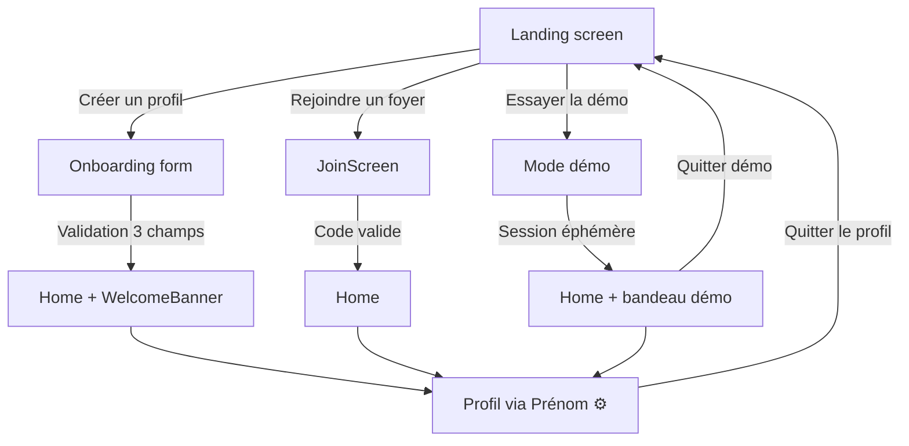

# UX — Onboarding & Profil

## Vue d'ensemble

L'onboarding permet de créer un foyer et d'enregistrer les informations du bébé. Le profil permet de les modifier après coup. L'architecture reprend le modèle éprouvé du projet **atable** (foyer partagé, code d'invitation, sessions par appareil) en l'adaptant au contexte bébé.

> **Référence architecturale** : `/Users/anthony/Documents/dev/claude/atable` — household-based auth, join codes, device sessions, demo mode. L'architecte et les devs s'y réfèreront pour les choix d'implémentation (JWT, sessions, Supabase, etc.).

## Flow global



## Scope

- **Mono-bébé** : un seul bébé par foyer. Pas de sélecteur multi-bébé pour le moment.
- **Foyer partagé** : les deux parents (ou tout aidant) accèdent aux mêmes données via un code d'invitation.

---

## Landing screen

Écran affiché au premier lancement (aucune session active).

### Options

| # | Label | Style | Action |
|---|-------|-------|--------|
| 1 | **Essayer la démo** | Primary | Crée une session éphémère avec des données fictives |
| 2 | **Créer un profil** | Secondary | Démarre l'onboarding (création foyer + bébé) |
| 3 | **Rejoindre un foyer** | Lien discret | Saisie d'un code d'invitation pour rejoindre un foyer existant |

### Style

- Fond neutre (`bg`), centré verticalement.
- Illustration bébé (visage + couette + feuilles) au-dessus du nom de l'app.
- Nom de l'app « **pousse** » en 32px, font-weight 800, couleur `sleep.icon`.
- Tagline « Suivi bébé simple et serein » en 10px, font-weight 600, couleur `textSec`.
- 3 boutons empilés en bas : démo en primary (accentColor, texte blanc), créer en secondary (fond accent/10, border accent/20), rejoindre en lien sans fond.

---

## Onboarding — Création de profil

### Champs

Trois champs collectés sur un seul écran, dans l'ordre :

| Champ | Input | Contraintes |
|-------|-------|-------------|
| **Prénom du bébé** | Champ texte, clavier standard | Obligatoire, 1–30 caractères |
| **Date de naissance** | Date picker custom (scroll wheels, même UX que le time picker) | Obligatoire, ≤ aujourd'hui |
| **Poids actuel** | Scroll wheels (même UX que le time picker) | Obligatoire, 2.0–15.0 kg |

### Poids — Scroll wheels

Le picker de poids réutilise le composant scroll wheels existant (cf. time picker dans `design-reference.html`) avec deux colonnes :

| Colonne | Unité | Plage | Pas |
|---------|-------|-------|-----|
| Gauche | **kg** | 2–15 | 1 |
| Droite | **hg** (hectogrammes) | 0–9 | 1 |

- Affichage du label entre les colonnes : `kg` à droite de la colonne gauche, `,` ou rien entre les deux.
- Valeur par défaut au premier affichage : **3 kg 5** (médiane nouveau-né).
- Le composant est identique visuellement au time picker : colonnes snap, friction, momentum scroll.

### Bouton de validation

- Label : "C'est parti"
- Style : primary, pleine largeur.
- Désactivé tant que les 3 champs ne sont pas remplis.

### Flow post-validation

1. Création du foyer côté serveur (génération du code d'invitation).
2. Création de la session (cookie JWT httpOnly, ~1 an).
3. Redirection vers l'écran principal avec un **banner de bienvenue** (cf. section ci-dessous).

---

## Banner de bienvenue (post-création)

Affiché une seule fois après la création du foyer, en haut de l'écran principal (au-dessus de la date).

### Contenu

```
🎉 Bienvenue !

Partagez ce code pour que l'autre parent
puisse rejoindre le foyer :

         OLVR-4821

     [ Copier le lien ]
```

- **Code d'invitation** : format `XXXX-0000` (ex. `OLVR-4821`), affiché en gros (16px, font-weight 700, `text`).
- **Bouton "Copier le lien"** : copie le lien d'invitation dans le presse-papier (`/join/OLVR-4821`). Style secondary.
- **Fermeture** : bouton ✕ en haut à droite, ou tap hors banner. Une fois fermé, ne réapparaît plus. Le code reste accessible dans le profil.

> **Maquette** : cf. `design-reference.html` § Welcome Banner.

---

## Rejoindre un foyer

### Saisie du code

- Champ texte unique, placeholder "Code d'invitation" (ex. `OLVR-4821`).
- Auto-lookup : validation automatique dès que le format `XXXX-0000` est reconnu (8 caractères alphanumériques, insensible à la casse, tiret optionnel). Debounce 300ms.
- Feedback : spinner pendant la vérification, message d'erreur si code invalide ("Code introuvable, vérifiez la saisie").

> **Maquette** : cf. `design-reference.html` § Rejoindre (états vide, chargement, erreur, succès).

### Lien d'invitation

Alternative au code : le parent qui a créé le foyer envoie un lien `/join/[CODE]`. L'ouverture du lien rejoint automatiquement le foyer (même logique que la saisie manuelle, sans étape de saisie).

### Flow post-join

1. Création de la session (cookie JWT httpOnly, ~1 an).
2. Redirection vers l'écran principal. Pas de banner de bienvenue (le code est déjà connu du parent qui rejoint).

---

## Mode démo

- Crée une session éphémère avec des données fictives (bébé "Léo", 4 mois, historique de biberons et siestes).
- Fonctionnalités identiques à un vrai foyer, sauf : pas de code d'invitation, pas de multi-appareil.
- Un bandeau discret en **haut** de l'écran rappelle "Mode démo — données non conservées" avec un CTA "Quitter".
- Les données démo ne sont pas conservées si le parent crée un vrai profil.

### Données démo

- Bébé "Léo", né il y a ~4 mois. Journée réaliste avec historique de biberons et siestes.
- Les données sont **cohérentes chaque jour**, peu importe l'heure d'accès : le compte démo simule un snapshot figé à **17h30** (journée bien remplie, suffisamment d'événements pour montrer toutes les fonctionnalités).
- Les KPI cards, le récap et la hero card reflètent ces données générées.

### Implémentation technique — contraintes pour l'architecte

> L'architecte choisira l'approche technique, en respectant ces trois contraintes :

1. **Données cohérentes chaque jour** : le visiteur voit toujours une journée réaliste et remplie, quel que soit le moment d'accès.
2. **Toutes les fonctionnalités fonctionnent** : ajouter un biberon, toggle sommeil, modifier le profil, etc. — tout doit répondre normalement.
3. **Impossible de salir les données** : les actions d'un visiteur ne doivent jamais altérer l'état de base du compte démo (sinon il devient incohérent pour le visiteur suivant).

Les modifications du visiteur sont persistées en **session storage** uniquement. Aucune écriture en base de données.

---

## Accès au profil depuis l'écran principal

### Emplacement

Le prénom du bébé et une icône settings sont affichés **inline avec la date**, à droite, dans le header de l'écran principal.

```
Vendredi 7 mars                    Léo ⚙
```

- Même style que la date : 10px, font-weight 600, couleur `textSec`.
- L'icône ⚙ est un SVG gear 12×12, couleur `textSec`, placé **à droite** du prénom avec un gap de 3px.
- Le tout est un `<button>` sans background, cursor pointer.
- Tap → ouvre la page profil.

### Découvrabilité

Volontairement peu découvrable — le profil est rarement consulté. Le prénom en label offre un indice suffisant pour les parents qui cherchent. Pas de tooltip, pas de badge.

> **Maquette** : cf. `design-reference.html` § Accès Profil.

---

## Page profil

Écran dédié, navigation depuis le header (bouton retour ← en haut à gauche).

### Sections

#### 1. Informations bébé

| Champ | Affichage | Édition |
|-------|-----------|---------|
| **Prénom** | Texte inline, éditable au tap | Champ texte, validation idem onboarding |
| **Date de naissance** | Date formatée (ex. "7 mars 2026") | Date picker custom (scroll wheels) |
| **Poids** | Valeur formatée (ex. "4,2 kg") | Scroll wheels (même composant que l'onboarding) |

- Chaque champ est éditable au tap (inline editing, pas de page séparée).
- Sauvegarde automatique au blur / validation — pas de bouton "Enregistrer" global.
- Le poids s'édite via les scroll wheels inline avec un bouton "OK" pour confirmer.

> **Maquette** : cf. `design-reference.html` § Profil édition (état édition poids).

#### 2. Rappel de pesée

- Label : "Rappel de pesée"
- Description : "Un rappel mensuel pour mettre à jour le poids"
- **Fréquence** : mensuel, le **jour de naissance + 10 jours**.
  - Ex. bébé né le 15 → rappel le 25 de chaque mois.
  - Si jour > 28 → dernier jour du mois (ex. né le 30 → rappel le 28 février).
- **Format** : notification push locale.
- **Toggle on/off** : activé par défaut à la création du profil.
- Le rappel ouvre directement le picker de poids (scroll wheels) dans un toast.

#### 3. Foyer

| Élément | Description |
|---------|-------------|
| **Code d'invitation** | Affiché en gros, format `XXXX-0000` |
| **Bouton "Copier le lien"** | Copie `/join/[CODE]` dans le presse-papier |
| **Appareils connectés** | Liste des appareils avec nom/type et date de dernière connexion |
| **Révoquer un appareil** | Bouton par appareil, confirmation simple ("Déconnecter cet appareil ?") |

#### 4. Actions

| Action | Style | Comportement |
|--------|-------|-------------|
| **Quitter le profil** | Bouton destructif (rouge) | Confirmation ("Quitter le profil ? Vous perdrez l'accès aux données.") → supprime la session, retour au landing screen |

- Si le dernier membre quitte → le foyer et ses données sont **supprimés définitivement** (hard delete).

---

## Sessions & authentification

### Modèle

Reprise du modèle **atable** :

- **Pas de compte individuel** : le foyer est l'entité centrale. Chaque appareil a une session indépendante.
- **JWT** : stocké en cookie httpOnly, expiration ~1 an, renouvelé silencieusement.
- **Multi-appareil** : chaque appareil connecté est une session distincte. Un parent peut révoquer un appareil depuis le profil.
- **Tables** : `pousse_households` (id, baby_name, baby_dob, baby_weight, join_code, created_at) + `pousse_device_sessions` (id, household_id, device_name, last_seen, created_at).

### Code d'invitation

- Format : `XXXX-0000` — 4 lettres majuscules aléatoires + tiret + 4 chiffres aléatoires (ex. `OLVR-4821`).
- Le tiret est ajouté automatiquement à l'affichage et dans le lien ; l'utilisateur peut saisir avec ou sans tiret.
- Généré à la création du foyer, immuable.
- Unicité garantie côté serveur (26⁴ × 10⁴ ≈ 4,5 milliards de combinaisons).
- Lien d'invitation : `[base_url]/join/[CODE]`.

---

## Poids — Impact sur l'app

Le poids du bébé est utilisé pour :
- **Zone cible lait** (cf. `ux-kpi-cards.md` § Zone cible) : la quantité de lait recommandée dépend du poids.
- **Range du slider biberon** (cf. `ux-kpi-cards.md` § Interactions) : les bornes min/max du slider sont calculées à partir du poids.

Un changement de poids recalcule immédiatement ces valeurs. Pas de message de confirmation, le recalcul est transparent.

---

## Date de naissance — Impact sur l'app

La date de naissance est utilisée pour :
- **Zone cible sommeil** (cf. `ux-kpi-cards.md` § Zone cible) : la durée de sommeil recommandée dépend de l'âge.
- **Affichage de l'âge** : potentiellement dans le profil ou la hero card (non spécifié pour le MVP).

---

## État initial post-onboarding

Au retour sur l'écran principal après création :
- **KPI cards** : bar-fill à 0%, pas de bar-avg, bar-target calculée à partir du poids/âge renseignés.
- **Récap** : vide, placeholder "Les événements s'afficheront ici".
- **Hero card** : état `awake` (cf. `ux-sleep-state-machine.md`).
- **Header** : `[date]` à gauche, `[prénom] ⚙` à droite.

---

## Notes d'implémentation

### Référence atable

Le projet atable (`/Users/anthony/Documents/dev/claude/atable`) contient une implémentation complète du modèle foyer/sessions/invitations :
- **Landing** : `src/components/LandingScreen.tsx` (3 options : créer / rejoindre / démo)
- **Création** : champ nom de foyer → code auto-généré → session cookie → home
- **Join** : saisie code avec auto-lookup ou lien `/join/[CODE]`
- **Profil** : `src/components/HouseholdMenuContent.tsx` (nom inline editable, code, lien, appareils, quitter)
- **Auth** : JWT via `jose` (HS256), middleware route protection, sessions ~365 jours
- **DB** : tables `households` + `device_sessions` dans Supabase (pousse utilise ses propres tables préfixées `pousse_`)

L'architecte adaptera cette base avec des tables dédiées préfixées `pousse_` et les champs bébé (prénom, date de naissance, poids).

### Composants à créer

| Composant | Description |
|-----------|-------------|
| **LandingScreen** | 3 CTA : Créer / Rejoindre / Démo |
| **OnboardingForm** | 3 champs + bouton validation |
| **WeightPicker** | Scroll wheels kg\|hg (variante du TimePicker existant) |
| **WelcomeBanner** | Banner one-shot post-création avec code |
| **ProfileScreen** | Sections info bébé + rappel + foyer + actions |
| **JoinScreen** | Saisie code / auto-lookup |
| **ProfileHeaderButton** | Bouton `Prénom ⚙` inline avec la date |

### Points UX à valider en conditions réelles

- **Scroll wheels poids** : vérifier que la granularité 100g (hectogrammes) est suffisante. Si les parents veulent plus de précision → passer à des pas de 50g (0, 5 au lieu de 0–9).
- **Banner de bienvenue** : tester si les parents comprennent le concept de "code d'invitation" sans explication supplémentaire. Si non → ajouter une phrase d'explication.
- **Rappel de pesée** : le délai "jour de naissance + 10 jours" est un choix arbitraire. À ajuster selon les retours.
